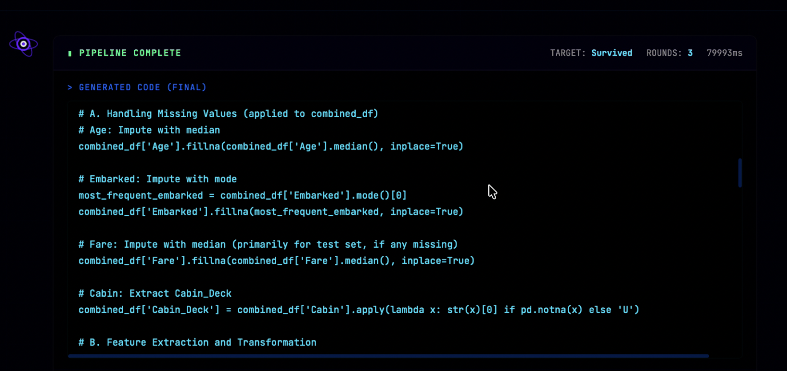
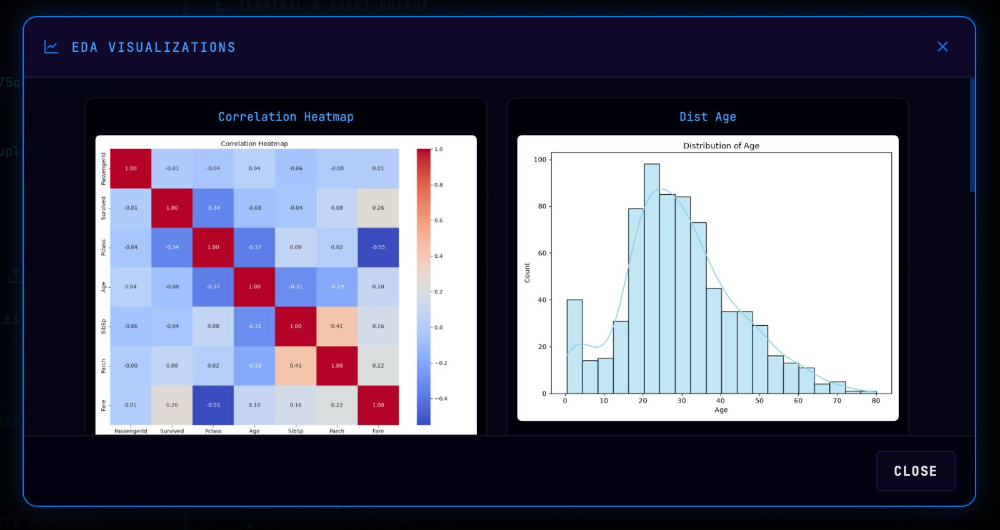
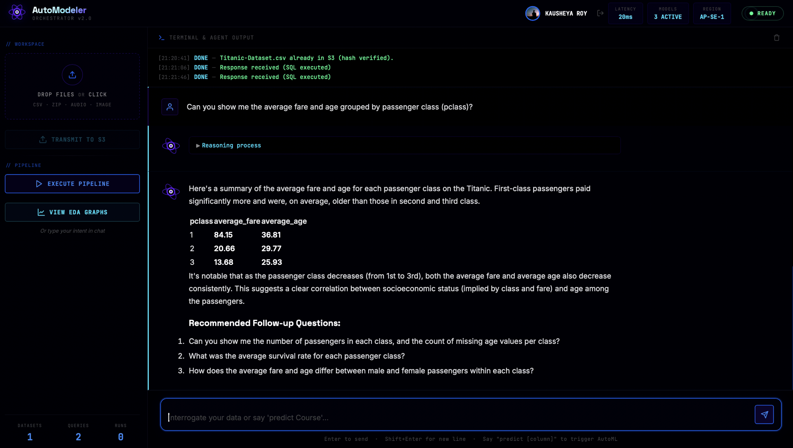
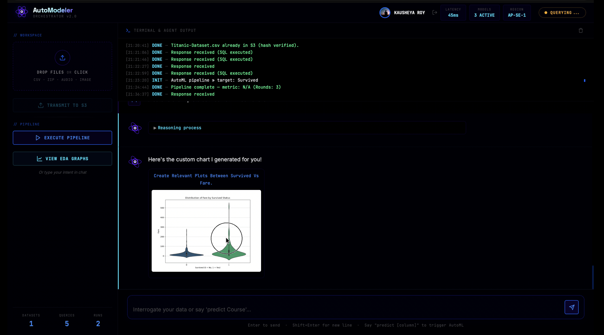

# AutoModeler


## Table of Contents

* [Overview](#overview)
* [Live Demo & Walkthrough](#live-demo--walkthrough)
* [Architecture](#architecture)
* [Infrastructure & Integrations](#infrastructure--integrations)
  * [CockroachDB Tools Used](#cockroachdb-tools-used)
  * [AWS Services Used](#aws-services-used)
* [Features](#features)
* [Pipeline](#pipeline)
* [Why AutoModeler](#why-automodeler)
  * [Agentic Memory](#agentic-memory)
  * [CockroachDB Integration](#cockroachdb-integration)
  * [Real-World Use Case](#real-world-use-case)
  * [Production Considerations](#production-considerations)
  * [What Makes the Architecture Different](#what-makes-the-architecture-different)
* [Technology Stack](#technology-stack)
* [Getting Started](#getting-started)
  * [Prerequisites](#prerequisites)
  * [Repository Setup](#repository-setup)
  * [AWS Deployment](#aws-deployment)
  * [Running the Frontend](#running-the-frontend)
* [Configuration](#configuration)
* [Usage](#usage)
* [Repository Structure](#repository-structure)
* [Documentation](#documentation)
* [Limitations](#limitations)
* [License](#license)

## Overview

AutoModeler is a serverless data engineering and machine learning pipeline that processes raw CSV files uploaded to Amazon S3. Upon upload, the system autonomously profiles the data, generates exploratory data visualizations, synthesizes a database schema via an LLM, provisions a CockroachDB Serverless cluster, and embeds the rows for semantic vector search. It exposes a natural language RAG interface and an iterative machine learning agent to query and model the processed dataset.

<p align="center">
  
  
</p>

<p align="center">
  
  
</p>

## Live Demo & Walkthrough

**Try the app here:** 
[https://main.d1rb06txtu9pvr.amplifyapp.com/](https://main.d1rb06txtu9pvr.amplifyapp.com/)

[]([https://www.youtube.com/watch?v=YOUR_VIDEO_ID](https://youtu.be/T0uK3PMMRVM))


## Architecture

<image src='assets/pipeline.png' width=600 style="border-radius: 12px">

## Infrastructure & Integrations

### CockroachDB Tools Used

- **ccloud CLI:** Integrated directly into the AWS Lambda container via a subprocess. When a user uploads a new dataset without a predefined database, the agent automatically runs `ccloud cluster create serverless ...` to provision an isolated cluster on the fly.

- **Distributed Vector Indexing:** The pipeline leverages CockroachDB's `VECTOR(768)` columns. The LLM agent generates `CREATE VECTOR INDEX` statements to utilize the native C-SPANN distributed indexing algorithm for high-performance approximate nearest neighbor (ANN) similarity search.

### AWS Services Used

- **Amazon S3:** Acts as the primary object storage for raw CSV uploads, generated EDA plot images (`eda-output/`), and maintaining the agent's memory state file. S3 Event Notifications are the primary trigger for the ETL pipeline.

- **AWS Lambda:** The core serverless compute engine. Packaged as a custom Docker Container Image to include heavy libraries (`torch`, `sentence-transformers`, `scikit-learn`). It executes the 8-stage ETL pipeline, local embeddings, and ML reasoning loops asynchronously.

- **Amazon API Gateway:** Exposes HTTP endpoints for the frontend to request S3 Presigned URLs and to securely communicate with the Chat/AutoML agents.

- **AWS Amplify:** Hosts the static Vanilla JavaScript/HTML frontend on a globally distributed CDN with automatic CI/CD deployments.

### Authentication

- **Firebase Authentication:** Secures user access using Google Sign-In with a professional, enterprise-grade popup integration on the "Get Started" page.

## Features

- **Enterprise User Authentication:** Secure Google Sign-In flow powered by Firebase, ensuring a robust and isolated user workspace.

- **Data Profiling:** Infers SQL data types and calculates descriptive statistics (quantiles, IQR, missing values).

- **Automated Visual EDA:** Generates correlation heatmaps and distribution histograms.

- **LLM Schema Synthesis:** Uses LLMs to generate denormalized `CREATE TABLE` and `CREATE VECTOR INDEX` statements.

- **Dynamic Database Provisioning:** Automatically spins up ephemeral CockroachDB serverless clusters via the `ccloud` CLI.

- **Semantic Vector Ingestion:** Computes 768-dimensional embeddings for tabular data and performs bulk database inserts.

- **Automated Query Optimization:** Synthesizes test queries, parses `EXPLAIN` plans for table scans, and executes generated indexing DDL.

- **Iterative ML Agent:** Generates, executes, and refines `scikit-learn` python code using an LLM reasoning loop.

- **Semantic RAG Chat:** Allows natural language querying of the dataset using the `<->` KNN vector distance operator.

## Pipeline

The end-to-end execution flow triggered by an S3 upload:

1. **Cluster Provisioning:** Verifies existing connections or creates a new CockroachDB Serverless cluster.

2. **Data Profiling:** Infers column types and calculates statistical boundaries.

3. **Visual EDA:** Generates and uploads `.png` distributions and correlation heatmaps to S3.

4. **Schema Generation:** Uses an LLM to design the table structure and vector indexes.

5. **Schema Deployment:** Drops existing tables (if any) and executes the DDL.

6. **Data Transformation:** Cleanses missing values and deduplicates rows via hashing.

7. **Vector Embedding & Ingestion:** Encodes rows using a local `sentence-transformers` model and executes bulk inserts.

8. **Query Optimization:** Generates test queries and automatically applies indexes if full table scans are detected.

## Why AutoModeler

### Agentic Memory

CockroachDB serves as the core semantic memory and retrieval layer for the application's agents. When raw CSV data is processed, the `VectorEngine` computes 768-dimensional embeddings using a local `all-mpnet-base-v2` model and stores them alongside the structured data in an `embedding VECTOR(768)` column. 

When a user interacts with the `IntelligentChatAgent`, the query is vectorized and executed against CockroachDB using the `<->` (KNN distance) operator. This retrieves the most semantically relevant operational rows. The retrieved rows are passed directly into the LLM context (Groq) to generate data-grounded responses. The conversation state itself is maintained in memory during the chat session, while the dynamic database connection URL is persisted in Amazon S3 (`agent_memory_state.txt`) so stateless Lambda invocations can reconnect to the correct memory store.

### CockroachDB Integration

The system deeply integrates with CockroachDB rather than treating it as a generic SQL store:

- **Serverless Provisioning:** The pipeline uses a `subprocess` to execute the `ccloud cluster create serverless` CLI command dynamically within AWS Lambda, spinning up isolated databases on the fly without human intervention.

- **Distributed Vector Indexing:** The `SchemaArchitect` natively generates `CREATE VECTOR INDEX` statements, taking advantage of CockroachDB's C-SPANN indexing algorithm for fast similarity searches over the `VECTOR(768)` column.

- **PostgreSQL Compatibility:** Connection and ingestion are handled natively via `psycopg2`.

- **Conflict Handling:** Bulk data ingestion utilizes `INSERT ... ON CONFLICT DO NOTHING` for idempotent execution.

- **Automated Indexing:** The `QueryOptimizer` executes simulated analytical queries using `EXPLAIN`. It explicitly parses the output for "full table scan" indicators and generates standard B-Tree `CREATE INDEX` statements to tune the database autonomously.

### Real-World Use Case

AutoModeler automates the highly manual data engineering workflow required to make raw tabular data accessible for AI analysis. In a traditional workflow, a data engineer must manually profile data, design a 3NF or analytical schema, provision infrastructure, write ETL scripts for cleansing and embeddings, and build RAG APIs.

By simply uploading a CSV to S3, this system executes that entire lifecycle autonomously. It turns a static CSV into a fully provisioned, indexed, and vectorized database. This allows analysts to immediately begin natural-language data exploration (RAG) and iterative machine learning modeling (`scikit-learn` code generation) without writing infrastructure or pipeline code.

### Production Considerations

The implementation addresses several baseline production concerns while acknowledging current limitations:

- **Configuration:** Managed strictly via environment variables (API keys, regions) rather than hardcoded credentials.

- **Idempotency:** Database inserts use conflict resolution (`ON CONFLICT`) to prevent duplicate data if the Lambda ETL triggers multiple times.

- **Resource Constraints:** The `VectorEngine` intentionally caps processing at 500 rows to adhere to AWS Lambda's 15-minute maximum timeout and prevent Out-Of-Memory (OOM) crashes during the intensive local HuggingFace embedding phase.

- **State Persistence:** Because AWS Lambda is stateless, critical infrastructure state (like the dynamically generated database URL) is persisted to Amazon S3.

- **Limitations:** The system is built as a functional prototype. It currently lacks user authentication and access control. Additionally, the `AutoMLAgent` executes LLM-generated Python code using the native `exec()` function; while this relies on the inherently ephemeral and isolated nature of the AWS Lambda container for safety, it lacks a formal secure sandbox.

### What Makes the Architecture Different

Unlike conventional LLM applications that rely on a static, pre-existing database and a separate dedicated vector database (e.g., Pinecone or Milvus), AutoModeler features a **dynamic infrastructure** approach paired with a **unified memory model**.

1. **Dynamic Infrastructure:** The system provisions its own isolated database infrastructure (`ccloud` CLI) in real-time based purely on an S3 event trigger.

2. **Unified Memory:** By utilizing CockroachDB for both strict relational data storage and distributed vector indexing, the agent avoids the synchronization complexity of maintaining separate relational and vector stores. The operational data *is* the semantic memory. 

3. **Automated Tuning:** The architecture closes the loop on database administration by having the agent autonomously run `EXPLAIN` plans and tune its own indexes, an architectural pattern that goes beyond simple text-to-SQL generation.

4. **Persistent Scalability vs. Ephemeral Sandboxes:** When you upload a CSV to ChatGPT, it loads the data into an ephemeral Python sandbox that vanishes when the chat ends. AutoModeler, conversely, provisions a **true persistent transactional database** (CockroachDB). This means the uploaded data is securely typed, indexed, vectorized, and made instantly available for simultaneous API access across a distributed system, rather than being trapped in a single user's chat session.

## Technology Stack

| Component | Technology |
|---|---|
| Runtime | Python 3.11 |
| Compute | AWS Lambda (Docker Container) |
| Object Storage | Amazon S3 |
| Database | CockroachDB Serverless |
| LLM | Groq API, OpenRouter API, DeepSeek API |
| Embeddings | `sentence-transformers` (`all-mpnet-base-v2`) |
| API | Amazon API Gateway |
| Frontend | Vanilla JavaScript, HTML5, CSS3 |
| Hosting / CI/CD | AWS Amplify |

## Getting Started

### Prerequisites

- Python 3.11
- Docker
- AWS CLI configured with active credentials
- CockroachDB Cloud Account

### Repository Setup

Clone the repository and install the required dependencies:

```bash
git clone https://github.com/your-username/Automodeler.git
cd Automodeler
python3 -m venv .venv
source .venv/bin/activate
pip install -r requirements.txt
```

### AWS Deployment

The backend runs entirely on AWS Lambda via a Docker container image. You must authenticate with Amazon ECR and push the image. A script is provided to automate the build, push, and Lambda update:

```bash
python3 scripts/push_docker.py
```

*Note: This script assumes you have an ECR repository and Lambda function (`roy-lambda`) provisioned in `ap-southeast-1`.*

### Running the Frontend

To run the static frontend locally:

```bash
cd frontend
python3 -m http.server 3000
```

Access the UI at `http://localhost:3000`.

## Configuration

Configuration is managed via environment variables. For local testing or Docker deployment, create a `.env` file in the repository root.

| Variable | Required | Description |
|---|---|---|
| `GROQ_API_KEY` | Yes | Used for schema generation, chat, and python code synthesis. |
| `OPENROUTER_API_KEY` | Yes | Used for the `nemotron` reasoning loop during AutoML execution. |
| `DEEPSEEK_API_KEY` | Yes | Used by the chat agent for data formatting. |
| `AWS_DEFAULT_REGION` | Yes | Defines the AWS region for boto3 clients (e.g., `ap-southeast-1`). |
| `CCLOUD_API_KEY` | Conditional | Required if `TEST_DB_URL` is omitted to dynamically provision CockroachDB clusters. |
| `TEST_DB_URL` | Conditional | Static CockroachDB connection string. If provided, bypasses `ccloud` dynamic provisioning. |

## Usage

1. Open the frontend UI and drag a raw CSV file into the upload zone.

2. Click **Transmit to S3**. This uploads the file and triggers the background pipeline (profiling, schema generation, embeddings, insertion).

3. Wait for the pipeline to finish processing the data in CockroachDB.

4. Use the Chat Interface to query the database naturally. The agent will fetch relevant SQL data and EDA plots.

5. Click **Execute Pipeline** to trigger the ML agent (`AutoMLAgent`), which iteratively trains scikit-learn models against the target column.

## Repository Structure

```text
.
├── core/
│   ├── architect.py         # LLM schema synthesis
│   ├── auto_ml.py           # Iterative python execution and reasoning
│   ├── chat_agent.py        # RAG and SQL chat interface
│   ├── optimizer.py         # EXPLAIN parsing and auto-indexing
│   ├── profiler.py          # Data typing and descriptive statistics
│   ├── provisioner.py       # CockroachDB ccloud integration
│   ├── transformer.py       # Data cleansing and imputation
│   ├── vector_engine.py     # SentenceTransformer embeddings and psycopg2 execution
│   └── visual_profiler.py   # Matplotlib / Seaborn generation
├── docs/
│   └── technical_documentation.md
├── frontend/
│   ├── index.html
│   ├── config.js
│   ├── styles.css
│   └── script.js
├── scripts/
│   └── push_docker.py       # AWS ECR build/push and Lambda update script
├── Dockerfile               # Lambda container definition
├── lambda_function.py       # AWS Lambda entrypoint router
├── pipeline.py              # S3 event ETL orchestrator
└── requirements.txt
```

## Documentation

For detailed implementation specifics, database architecture, exact API flows, vector search mechanisms, and query optimization details, refer to the [Technical Documentation](docs/technical_documentation.md).

## Limitations

- **Processing Scale:** `VectorEngine.embed_and_insert` currently caps embedding processing to the first 500 rows of the dataset to maintain strict latency thresholds during demonstration usage.

- **Execution Constraints:** The pipeline operates within AWS Lambda limits (maximum 15-minute timeout). Massive datasets may trigger timeouts during the embedding or pandas transformation phases.

- **Dynamic Execution Security:** The AutoML module utilizes Python's `exec()` function to execute LLM-generated code. This implementation safely relies on the inherently ephemeral and isolated execution environment of AWS Lambda, but should be sandboxed further if ported to a persistent server.

## License

MIT License. See [LICENSE](LICENSE) for more information.

